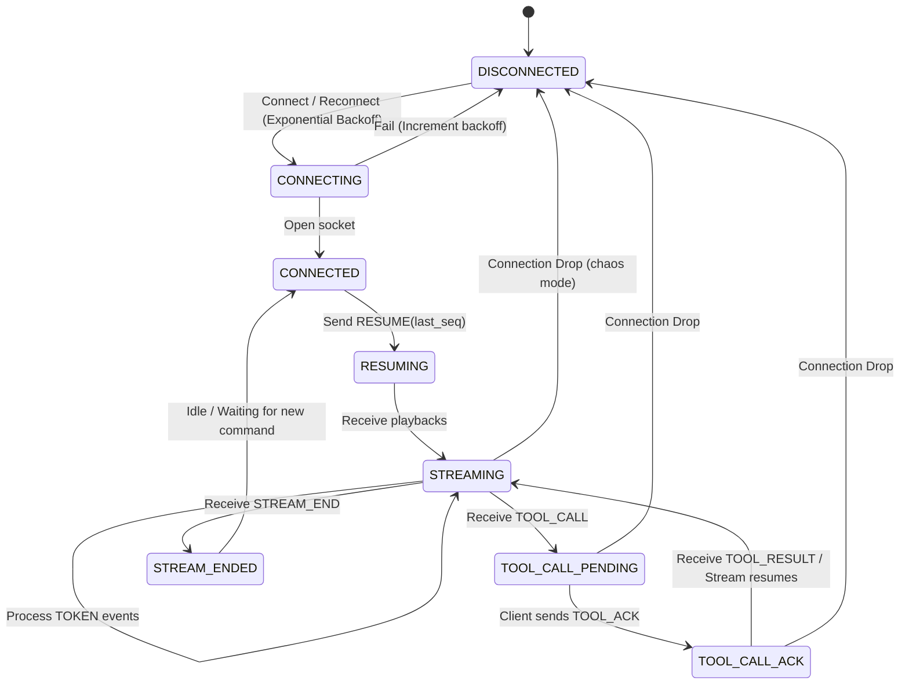

# Conduit — Agent Observability Console

Conduit is a premium agent observability console built with **Next.js (App Router)** and styled using a custom **Neobrutalism** palette. It connects to the Alchemyst AI Agent WebSocket server, rendering real-time streaming tokens, mid-stream tool execution cards, trace timelines, and context snapshot diffs. Under the hood, it implements an event-sourced reordering buffer and connection recovery layer to survive connection drops and message shuffling in chaos mode.

---

## Architectural Approach

Conduit separates raw network ingestion from the UI render loop. Incoming WebSocket events are routed through a sequence-based **reorder buffer** that enforces strict monotonicity, deduplicates redundant packages, and sorts out-of-order packets. Once the protocol engine validates the sequence, it commits the messages to the agent state machine, triggering smooth, layout-shift-free visual updates across the Trace Timeline, Streaming Feed, and Context State Panels.

---

## State Machine Diagram

Below is the WebSocket protocol state machine and connection state lifecycle:



---

## Design System & Palette

Conduit's user interface is styled using a highly tactile **Neobrutalism** design language:
* **Canvas Background**: Soft cream (`#e8e0d4`) with a radial dot grid pattern.
* **Primary Accent**: Vibrant teal (`#5eead4`) for active states, headers, and action buttons.
* **Containers**: Clean white (`#ffffff`) background cards outlined by thick solid black borders (`2px solid #000000`).
* **Visual Anchors**: Offset black shadows (`4px 4px 0px 0px #000000`) that maintain sharp contrast.
* **Typography**: Modern headings styled with the `Outfit` font family and monospace code tags/metrics powered by `JetBrains Mono`.

---

## Console Features

1. **Layout Shift-Free Streaming**: Displays token streams dynamically. During a `TOOL_CALL`, the active text block freezes in place while rendering tool status indicators inline. Streaming resumes from the precise block boundary without layout flickering.
2. **Trace Timeline**: An expandable left-hand sidebar containing sequence-indexed telemetry. Consecutive token events are consolidated into collapsible summaries to prevent UI lagging. Bidirectional linking highlights the corresponding segment in the chat layout.
3. **Context State Inspector**: A nested JSON tree visualizer displaying context state snapshots with real-time property diffing (green for additions, orange for updates, red for removals) and a history scrubbing timeline.
4. **Resilient Network Layer**: Integrates exponential backoff reconnection, automatic message buffering, and deduplication of replayed frames to survive simulated chaos mode network drops.

---

## Workspace Structure

The project repository contains the following key components:
* **[/agent-console](file:///c:/Users/ezboi/Documents/Cohort_3.0/Conduit/agent-console)**: Next.js App Router application.
  * **[hooks/useWebSocket.ts](file:///c:/Users/ezboi/Documents/Cohort_3.0/Conduit/agent-console/hooks/useWebSocket.ts)**: Handles sequence management, heartbeats, drop detection, and backoff connection logic.
  * **[hooks/useAgentState.ts](file:///c:/Users/ezboi/Documents/Cohort_3.0/Conduit/agent-console/hooks/useAgentState.ts)**: Maintains UI-facing data representations, text stream blocks, and context snapshots.
  * **[components/AutoTestRunner.tsx](file:///c:/Users/ezboi/Documents/Cohort_3.0/Conduit/agent-console/components/AutoTestRunner.tsx)**: Embedded test suite manager.
  * **[components/ChatPanel.tsx](file:///c:/Users/ezboi/Documents/Cohort_3.0/Conduit/agent-console/components/ChatPanel.tsx)**: Streaming feed window.
  * **[components/TraceTimeline.tsx](file:///c:/Users/ezboi/Documents/Cohort_3.0/Conduit/agent-console/components/TraceTimeline.tsx)**: Left-side timeline observer.
  * **[components/ContextInspector.tsx](file:///c:/Users/ezboi/Documents/Cohort_3.0/Conduit/agent-console/components/ContextInspector.tsx)**: Interactive state diff visualizer.
* **[/agent-server](file:///c:/Users/ezboi/Documents/Cohort_3.0/Conduit/agent-server)**: Node.js server simulating structured WebSocket and HTTP telemetry under normal and chaotic conditions.
* **[DECISIONS.md](file:///c:/Users/ezboi/Documents/Cohort_3.0/Conduit/DECISIONS.md)**: Architectural specifications and performance scaling decisions.

---

## Live Telemetry Metrics

The console exposes a dedicated metrics bar to monitor the state of the websocket transport:
* **Transport State**: Live connection health status (`connected`, `connecting`, `disconnected`).
* **Expected Sequence / Last Committed**: The target next sequence number and the highest sequence parsed and committed to UI state.
* **Buffer Size**: Queued out-of-order packets waiting for missing sequences.
* **Duplicate Drops**: Counter tracking duplicate messages dropped by the client.
* **Heartbeat Latency**: Round-trip time (RTT) calculated between receiving a `PING` from the server and sending a `PONG`.
* **Event Throughput**: Active frequency of events processed per second.
* **Reconnect Counts**: Total reconnection attempts performed.

---

## Getting Started

### 1. Prerequisites
Ensure you have the following installed on your machine:
* Node.js (v20 or newer)
* Docker (for the agent backend server)

### 2. Start the Backend Server
Navigate to the server directory, build the docker image, and run it:

**Normal Mode:**
```bash
cd agent-server
docker build -t agent-server .
docker run -p 4747:4747 agent-server
```

**Chaos Mode (Simulates network drops and out-of-order packet delivery):**
```bash
docker run -p 4747:4747 agent-server --mode chaos
```

### 3. Start the Next.js Frontend
Navigate to the console directory, install the required packages, and launch the development server:
```bash
cd agent-console
npm install
npm run dev
```

Open your browser and navigate to `http://localhost:3000`.

---

## Running Automated Integration Tests

Click the **RUN INTEGRATION SUITE** button in the console header to execute the integration runner. It sequences through exactly 7 script cases:

1. **Simple Greeting** (`hello`, `hi`, `hey`): Basic token streaming validation.
2. **Report Summary** (`report`, `summary`, `q3`): Executes one mid-stream tool call.
3. **Multi-Tool Analysis** (`analyze`, `compare`): Executes two sequential tool calls.
4. **Knowledge Base Lookup** (`lookup`, `find`, `search`): Runs a tool call before any token streams begin.
5. **Large Context** (`schema`, `database`, `large`): Validates processing of deep >500KB state schemas.
6. **Long Response** (`long`, `detailed`, `document`): Verifies high-throughput long token streams.
7. **Default** (`help`): Verifies a moderate response containing one tool call.

### Controls:
* **ABORT**: Immediately halts the websocket connection, freezes the streaming UI, and marks the active step with a red `✗`.
* **START SUITE**: Resets the current console session (clears screen blocks, timeline history, and sequence counters), establishes a new websocket connection, and restarts the tests.

---

## Running Unit Tests
To run unit and benchmark tests using Vitest:
```bash
cd agent-console
npm run test
```

---

## Session Recording

A session recording demonstrating the console's user interface, stream visualization, tool execution cards, trace timeline, context diffing inspector, and recovery under simulated network drops is provided as part of the submission package.