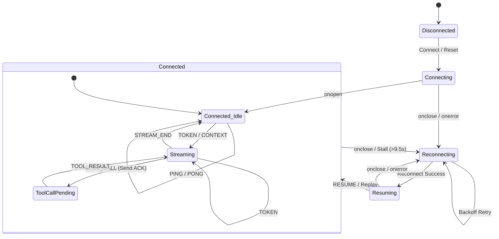

# Conduit

A Next.js agent observability console that connects to a mock AI agent backend over WebSockets. It renders streaming token responses with mid-stream tool call interruptions, displays a live trace timeline, visualizes context snapshot diffs, and survives the backend's chaos mode (connection drops, out-of-order delivery, duplicates, corrupt heartbeats) without crashing or losing state.

The architecture separates protocol ingestion from rendering. A sequence-gated reorder buffer sits between the raw WebSocket and the React state layer, enforcing strict monotonic ordering before any event touches the DOM. This means the UI never sees out-of-order or duplicate data, even when the network is actively hostile.

## Run It

### Prerequisites
- Node.js 20+
- Docker

### Start the backend
```bash
cd agent-server
docker build -t agent-server .
docker run -p 4747:4747 agent-server              # normal mode
docker run -p 4747:4747 agent-server --mode chaos  # chaos mode
```

### Start the frontend
```bash
cd agent-console
npm install
npm run dev
```

Open `http://localhost:3000`.

### Run tests
```bash
cd agent-console
npm run test
```


## WebSocket Connection State Machine

The client-side state machine handles connection drops, heartbeats, tool calls, streaming states, and recovery from transport stalls:



## Chaos Mode Recording

> **[Video will be added here]**
>
> A 3-5 minute screen recording demonstrating: connection drop mid-stream with seamless recovery, out-of-order message reordering, rapid sequential tool calls, oversized 500KB+ context snapshot rendering, and corrupt heartbeat handling.

## What's Inside

| Directory | Purpose |
|---|---|
| `agent-console/hooks/useWebSocket.ts` | Protocol layer: seq buffer, dedup, backoff reconnect, RESUME, PONG |
| `agent-console/hooks/useAgentState.ts` | UI state: stream blocks, timeline event batching, context snapshots |
| `agent-console/components/` | React components: chat feed, trace timeline, context inspector, test runner |
| `agent-console/core/` | Standalone `ProtocolEngine` class, typed event definitions, `SafeAny` escape hatch |
| `agent-console/utils/diff.ts` | Recursive JSON diff engine for context snapshots |
| `agent-console/tests/` | Vitest suites for reorder buffer, diff engine, and reconnect state recovery |
| `agent-server/` | Provided Docker backend (not modified) |
| `DECISIONS.md` | Architectural decisions and tradeoffs |